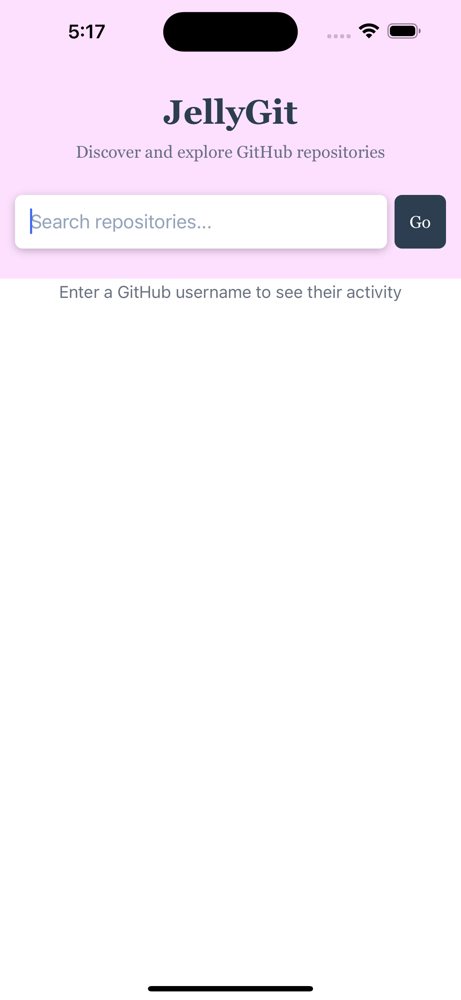
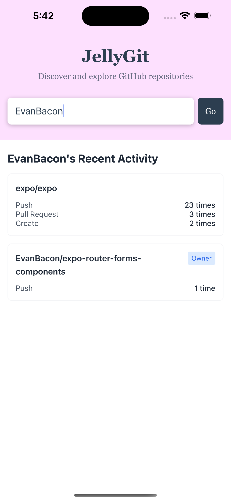

# JellyGit 📊

Full Disclaimer - I went a little outside the line with this one but I really wanted to showcase React Native work. I kept the work to under 2 hours as per the instructions. 

JellyGit is a React Native application that provides insights into GitHub user activity. Built with Expo, it helps track development trends across projects by analyzing public GitHub activity.

## Features

- View GitHub user activity across their repositories
- Analyze top 3 most common activity types per repository
- Identify repositories owned by the user
- Clean, modern UI with intuitive navigation

## Demo

The app includes several key screens:

1. User Search - Find GitHub users to analyze
2. Activity Overview - See total activity across repositories
3. Repository Details - View specific repository activity
4. Activity Breakdown - Analyze activity types and patterns

<div style="display: grid; grid-template-columns: repeat(2, 1fr); gap: 10px; margin: 20px 0;">
  
  
  
  
</div>

## Technical Details

- Built with React Native and Expo
- Uses GitHub's public API (no authentication required)
- Implements file-based routing
- Responsive design for both iOS and Android

## Getting Started

1. Install dependencies:
   ```bash
   npm install
   ```

2. Start the development server:
   ```bash
   npx expo start
   ```

3. Run on your preferred platform:
   - iOS Simulator
   - Android Emulator
   - Physical device using Expo Go

## Project Structure

- `/app` - Main application code
- `/assets` - Images and other static assets
- `/components` - Reusable React components
- `/services` - API integration and data processing

## Development

The project uses Expo's file-based routing system. You can start developing by editing files in the `app` directory.

## Requirements

- Node.js 14 or higher
- npm or yarn
- Expo CLI
- iOS Simulator (for iOS development)
- Android Studio (for Android development)

## License

This project was created as part of a technical interview for Jellyvision.
